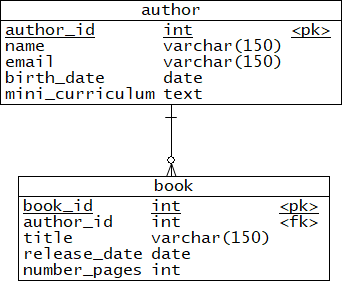

# livraria_rest
Aplicação Web em Java para gestão de uma livraria online utilizando o Spring Boot para criar uma API REST

O objetivo deste repositório é o desenvolvimento incremental do projeto final do [bootcamp de Java da Alura](https://www.alura.com.br/bootcamp/back-end-java/matriculas-abertas)

### Módulo 2 - 13/09/2021

No segundo módulo, o projeto deve disponibilizar API's Rest utilizando o Spring Boot e as bibliotecas Lombok, ModelMapper e Bean Validation para cadastro e listagem de autores e cadastro e listagem de livros.

Um livro deve possuir as seguintes informações: título, data de lançamento, número de páginas e id do autor.

Um autor deve possuir as seguintes informações: nome, e-mail, data de nascimento e mini currículo. 

Ao cadastrar um novo livro, as seguintes regras deverão ser validadas:

- Título deve ser obrigatório e ter no mínimo 10 caracteres;
- Data de lançamento deve ser uma data menor ou igual a data atual;
- O número de páginas deve ser maior ou igual a 100.

### Módulo 3 - 27/09/2021

No módulo 3, além de implementar a camada de persistência com o Spring Data JPA, também deverá ser desenvolvido um relatório de quantidade de livros publicados por autor.

Essa funcionalidade deverá retornar um JSON com os dados do relatório para que a aplicação frontend consiga fazer a geração de um gráfico no seguinte formato:

[{
    “autor” : "André da Silva”,
    “quantidadeLivros” : 2,
    “percentual” : 28.57
},
{
    “autor” : "Juliana Carvalho”,
    “quantidadeLivros” : 1,
    “percentual” : 14.29
}]

O banco de dados foi modelado da seguinte forma:

